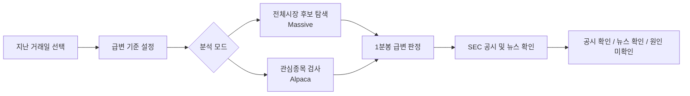

<p align="center">
  
</p>

<h1 align="center">CRT 0.2</h1>

<p align="center">
  <strong>Catalyst Rapid-move Tracker</strong><br>
  미국 주식의 급격한 가격 움직임을 사후 탐지하고, 뉴스와 SEC 공시 근거를 연결하는 macOS 리서치 베타
</p>

<p align="center">
  
  
  
</p>

## Overview

`CRT`는 1분, 2분, 5분처럼 짧은 구간에 급격한 상승이 발생했던 미국 주식 후보를 찾고, 그 움직임과 같은 날짜의 공시 또는 시점 주변 뉴스를 함께 확인하는 조사 도구입니다.

현재 `CRT 0.2`는 **실시간 매매 신호 앱이 아니라 지난 거래일을 분석하는 기능형 베타**입니다. 사용자는 본인의 무료 데이터 API 키를 입력해 실제 과거 데이터를 조회하며, 결과는 투자 추천이 아닌 조사 출발점으로 제공됩니다. 내부 빌드 버전은 `0.2.0`입니다.

## What It Does

| 기능 | 데이터 소스 | 현재 동작 |
| --- | --- | --- |
| 전체시장 급변 후보 스캔 | Massive historical aggregates | 선택한 지난 거래일의 전체시장 일별 후보를 좁힌 후 상위 후보의 1분봉 급변 여부를 검사 |
| 관심종목 뉴스·공시 분석 | Alpaca bars/news, SEC EDGAR | 최대 30개 관심종목의 분봉 급변을 검사하고 뉴스·당일 공시를 연결 |
| 공시 원문 확인 | SEC EDGAR | 결과 카드에서 확인된 공시 링크 제공 |
| 기준 조절 | 로컬 앱 설정 | 시간 창, 상승률, 최소 거래대금 조정 |
| 편한 날짜 선택 | SwiftUI calendar | 큰 달력, 직전 거래일·1주 전·1개월 전 빠른 선택, 주말 자동 조정 |
| 결과 필터 | 로컬 화면 | 전체, 공시, 뉴스, 원인 미확인 결과만 골라 표시 |
| 완료 알림 | macOS Notifications | 사용자가 허용한 경우 수동 분석 완료와 급변 후보 수를 알림 |
| 자격정보 보관 | macOS Keychain | Mac 앱에서 API 키를 로컬 키체인에 저장 |

## Analysis Flow



## macOS App

앱은 SwiftUI로 작성된 네이티브 macOS 프로젝트이며 Xcode에서 직접 열어 수정할 수 있습니다.

### Run In Xcode

1. [CRT.xcodeproj](CRTMac/CRT.xcodeproj)을 Xcode로 엽니다.
2. Xcode 상단 실행 버튼을 누릅니다.
3. 앱에서 `설정`을 열어 데이터 조회용 키를 입력합니다.
4. 지난 거래일을 고른 뒤 `전체시장 급변 후보 스캔` 또는 `관심종목 뉴스·공시 분석`을 실행합니다.

처음 사용하는 방법은 [Mac 앱 사용방법](CRTMac/사용방법.md), 직접 화면과 기능을 고치는 방법은 [Xcode에서 수정하기](CRTMac/Xcode에서_수정하기.md)를 참고하세요.

### Build A Shareable Beta

```bash
cd CRTMac
./build-app.sh
```

생성 파일:

- `CRTMac/build/CRT.app`
- `CRTMac/build/CRT-0.2.zip`

현재 배포 파일은 개인 테스트용 ad-hoc 서명 빌드입니다. 일반 사용자에게 경고 없는 설치 경험을 제공하려면 Apple Developer 서명과 공증 절차가 추가로 필요합니다.

## Data Requirements

| 목적 | 필요한 항목 | 무료 범위에서의 사용 방식 |
| --- | --- | --- |
| 전체시장 사후 후보 탐색 | Massive Stocks Basic API Key | 과거 일별 데이터와 후보별 분봉 확인 |
| 관심종목 뉴스 포함 조사 | Alpaca API Key / Secret Key | 지난 날짜 분봉 및 과거 뉴스 조회 |
| 공식 공시 연결 | 연락 이메일 | SEC EDGAR 요청의 사용자 식별용 헤더에 사용 |

2026년 5월 25일 확인 기준, Massive Stocks Basic은 무료 과거 데이터와 분봉 집계를 제공하지만 분당 호출 제한이 있으므로 상세 분봉 확인을 상위 후보 4개로 제한합니다. Alpaca Basic은 최근 15분보다 오래된 SIP 과거 데이터 조회가 가능하므로 본 베타의 사후 분석에 활용합니다.

## Repository Layout

```text
.
|-- CRTMac/                        # SwiftUI macOS application
|   |-- CRT.xcodeproj/             # Xcode project
|   |-- Resources/                 # CRT app icon assets
|   `-- Sources/CRT/               # UI, model, keychain, market analysis code
|-- public/                        # Browser prototype interface
|-- src/                           # Browser/server analysis modules
|-- test/                          # Detection and historical scan tests
|-- docs/                          # Architecture and data/privacy notes
`-- server.js                      # Local browser prototype server
```

## Engineering Notes

- 앱은 Massive, Alpaca, SEC를 브라우저 자동검색으로 긁는 방식이 아니라 공식 API 요청으로 연결합니다.
- 시세 후보 분석이 성공했다면, 뉴스 또는 공시 조회 실패는 경고로 표시하고 분석 결과 자체는 유지합니다.
- 브라우저 시험판은 입력한 키를 저장하지 않습니다. Mac 앱은 키를 macOS Keychain에 저장합니다.
- `CRT 0.2`의 알림은 사용자가 직접 시작한 사후 분석의 완료 알림이며, 실시간 시장 감시 알림은 아닙니다.
- 감지 로직과 외부 응답 연결 흐름은 Node 테스트로 확인할 수 있습니다.

추가 설명:

- [Architecture](docs/ARCHITECTURE.md)
- [Data, Privacy and Limitations](docs/DATA_PRIVACY.md)

## Web Prototype

Mac 앱 외에도 기능 검증용 웹 화면이 포함되어 있습니다.

```bash
npm start
```

이후 `http://127.0.0.1:4173`에서 확인할 수 있습니다. 웹 화면 하단의 가상 시연 데이터는 UI 흐름 확인용이며, 상단의 사후 분석 기능은 사용자가 입력한 계정으로 실제 과거 데이터를 요청합니다.

## Verification

```bash
npm test
```

현재 테스트는 급변 감지 조건, 거래대금 필터, 반복 알림 제한, 과거 분봉 후보 감지, 뉴스·공시 연결, 전체시장 후보 선별 흐름을 다룹니다.

## Current Boundaries

- 실시간 전체시장 모니터링 또는 자동매매를 제공하지 않습니다.
- 뉴스나 공시가 없다는 결과는 매수 판단이나 원인 부재의 증명이 아닙니다.
- 분봉 고가·저가에 기반한 감지는 실제 체결 가능성을 보장하지 않습니다.
- 다중 사용자 서비스 또는 유료 제품으로 확장할 때는 데이터 재배포 권한과 관련 규제를 별도로 검토해야 합니다.

## Roadmap

| 버전 | 목표 |
| --- | --- |
| `CRT 0.1` | 지난 거래일 급변 후보 감지, 뉴스·공시 연결, macOS 앱 시험 배포 |
| `CRT 0.2` | 달력형 날짜 선택, 빠른 거래일 이동, 결과 필터, 분석 완료 Mac 알림 |
| 다음 단계 | 분석 결과 저장, 가격 흐름·근거 타임라인, 실시간 데이터 가능성 검토 |
| 이후 검토 | 배포용 서명·공증과 온보딩 개선 |

## References

- [Massive Stocks Pricing](https://massive.com/pricing?product=stocks)
- [Alpaca Market Data API](https://docs.alpaca.markets/docs/about-market-data-api)
- [SEC EDGAR APIs](https://www.sec.gov/search-filings/edgar-application-programming-interfaces)

## Disclaimer

`CRT`는 학습 및 리서치 목적의 프로토타입입니다. 투자자문, 투자권유, 자동매매 서비스가 아니며, 표시된 자료만으로 투자 결정을 내려서는 안 됩니다.
