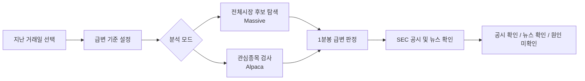

<p align="center">
  
</p>

<h1 align="center">CRT 0.10</h1>

<p align="center">
  <strong>Catalyst Rapid-move Tracker</strong><br>
  사용자 본인의 데이터 연결로 미국 주식 급등락을 감지하고, 근거 조사를 돕는 macOS 스캐너 베타
</p>

<p align="center">
  
  
  
</p>

## Overview

`CRT`는 짧은 구간에 급격한 상승 또는 하락이 발생한 미국 주식 후보를 찾고, 그 움직임과 같은 날짜의 공시 또는 시점 주변 뉴스를 함께 확인하는 조사 도구입니다.

현재 `CRT 0.10`은 **사용자가 자신의 API Key를 연결해 자기 Mac에서 계속 실행하는 시장 감시 베타**입니다. 포착 이벤트와 이후 `1`, `5`, `15`분 결과를 저장하고, 선택 종목의 실시간 분봉 차트를 제공하며, 역사적 `+300%` 급등 후보를 검증해 Supporter ML 데이터셋 기반을 쌓습니다. 내부 빌드 버전은 `0.10.0`입니다.

## What It Does

| 기능 | 데이터 소스 | 현재 동작 |
| --- | --- | --- |
| 전체시장 사후 분석 | Massive aggregates, Alpaca news, SEC EDGAR | 지난 거래일의 상위 급변 후보를 찾고 뉴스와 공시 근거를 연결 |
| 관심종목 뉴스·공시 분석 | Alpaca bars/news, SEC EDGAR | 최대 30개 관심종목의 분봉 급변을 검사하고 뉴스·당일 공시를 연결 |
| 공시 원문 확인 | SEC EDGAR | 결과 카드에서 확인된 공시 링크 제공 |
| 기준 조절 | 로컬 앱 설정 | 시간 창, 상승률, 최소 거래대금 조정 |
| 편한 날짜 선택 | SwiftUI calendar | 직접 날짜 입력, 연도 이동, 큰 달력, 최근 거래일 빠른 선택, 주말 자동 조정 |
| 결과 필터 | 로컬 화면 | 전체, 공시, 뉴스, 원인 미확인 결과만 골라 표시 |
| 완료 알림 | macOS Notifications | 사용자가 허용한 경우 수동 분석 완료와 급변 후보 수를 알림 |
| 지속 시장 감시 | Alpaca WebSocket IEX/SIP | 사용자가 중지할 때까지 초 단위 급등·급락 조건을 검사해 감지 로그와 Mac 알림 표시 |
| 감시 모드 선택 | 사용자 계정 권한 | `관심종목 · 무료 IEX` 또는 `전체시장 · 유료 SIP` 중 하나를 명확히 선택 |
| 연결 복구 | 로컬 앱 | 감시 중 연결 단절 시 자동 재연결을 시도 |
| 수신 진단 | 로컬 앱 | 감시 중 실제 수신 체결 수와 마지막 수신 시각을 표시하고 시험 기준을 빠르게 적용 |
| 급등락 TOP 20 | 수신 실시간 스트림 | 선택한 시간창의 절대 변동률이 큰 종목을 현재 감시 범위 안에서 정렬 |
| 포착 기록·사후 성적표 | 로컬 SQLite | 실시간 포착과 후속 체결 기준 1·5·15분 변화율, 고점·저점 결과를 Mac에 저장 |
| 자동 2차 조사 | Alpaca News, SEC EDGAR, Massive details | 포착 후 뉴스·최근 공시·기업 규모를 조사하고 희석 관련 양식을 경고 |
| 교차 확인 링크 | Stock Titan, Google News | API 뉴스가 없거나 추가 확인이 필요할 때 종목별 뉴스 페이지를 바로 열기 |
| 재알림 제어 | 로컬 설정 | 없음부터 30분까지 선택하며 감시 중 변경을 즉시 적용 |
| 실시간 분봉 차트 | Alpaca bars/WebSocket | 선택 종목의 오늘 캔들을 표시하고 `1·3·5·15분봉` 전환 및 체결 갱신 |
| CSV 내보내기 | 로컬 파일 | 후행 성적과 2차 조사 항목을 사용자가 선택한 위치에 내보내 후속 검토 가능 |
| Supporter ML 데이터셋 | Alpaca bars, 로컬 SQLite | `+300%` 후보를 가격 검증해 사건·대조 표본으로 저장하며 예측치는 아직 표시하지 않음 |
| 자격정보 보관 | macOS Keychain | Mac 앱에서 API 키를 로컬 키체인에 저장 |

## Analysis Flow



## macOS App

앱은 SwiftUI로 작성된 네이티브 macOS 프로젝트이며 Xcode에서 직접 열어 수정할 수 있습니다.

### Run In Xcode

1. [CRT.xcodeproj](CRTMac/CRT.xcodeproj)을 Xcode로 엽니다.
2. Xcode 상단 실행 버튼을 누릅니다.
3. 앱에서 `설정`을 열어 데이터 조회용 키를 입력합니다.
4. `관심종목 · 무료 IEX` 또는 `전체시장 · 유료 SIP` 모드를 고르고 `시장 감시 시작`을 누릅니다.
5. 지난 날짜를 돌아볼 때는 아래 `사후 분석` 영역에서 1회 분석을 실행합니다.

처음 사용하는 방법은 [Mac 앱 사용방법](CRTMac/사용방법.md), 직접 화면과 기능을 고치는 방법은 [Xcode에서 수정하기](CRTMac/Xcode에서_수정하기.md)를 참고하세요.

### Build A Shareable Beta

```bash
cd CRTMac
./build-app.sh
```

생성 파일:

- `CRTMac/build/CRT.app`
- `CRTMac/build/CRT-0.10.zip`

현재 배포 파일은 개인 테스트용 ad-hoc 서명 빌드입니다. 일반 사용자에게 경고 없는 설치 경험을 제공하려면 Apple Developer 서명과 공증 절차가 추가로 필요합니다.

## Data Requirements

| 목적 | 필요한 항목 | 무료 범위에서의 사용 방식 |
| --- | --- | --- |
| 전체시장 사후 후보 탐색 | Massive Stocks Basic API Key | 과거 일별 데이터와 후보별 분봉 확인 |
| 관심종목 뉴스 포함 조사 | Alpaca API Key / Secret Key | 무료 IEX 지난 날짜 분봉 및 과거 뉴스 조회 |
| 관심종목 실시간 감지·차트 | Alpaca API Key / Secret Key | 무료 IEX 실시간 스트림 및 선택 종목 분봉, 최대 30개 감시 종목 |
| 전체 상장주 실시간 감지 | Alpaca SIP 접근 권한 및 키 | 사용자가 직접 구독한 SIP 실시간 스트림 |
| 공식 공시 연결 | 연락 이메일 | SEC EDGAR 요청의 사용자 식별용 헤더에 사용 |

2026년 5월 28일 확인 기준, Alpaca Basic에서 구독 없이 사용할 수 있는 주식 실시간 피드는 IEX이며 WebSocket은 최대 30개 종목입니다. Massive 공식 문서는 Ticker Overview가 `CIK`, `market_cap`, `share_class_shares_outstanding`, `weighted_shares_outstanding`를 제공한다고 안내합니다. SEC EDGAR submissions API는 인증 키 없이 CIK별 제출 내역 JSON을 제공하며, CRT는 사용자가 설정한 연락 이메일을 요청 식별에 사용합니다. `CRT 0.10`의 TOP 20과 차트 실시간 갱신은 앱이 직접 받은 스트림으로 계산합니다.

## Repository Layout

```text
.
|-- CRTMac/                        # SwiftUI macOS application
|   |-- CRT.xcodeproj/             # Xcode project
|   |-- Resources/                 # CRT app icon assets
|   `-- Sources/CRT/               # UI, model, keychain, market analysis code
|-- public/                        # Browser prototype interface
|-- src/                           # Browser/server analysis modules
|-- test/                          # Detection and historical scan tests
|-- docs/                          # Architecture and data/privacy notes
`-- server.js                      # Local browser prototype server
```

## Engineering Notes

- 앱은 Massive, Alpaca, SEC를 브라우저 자동검색으로 긁는 방식이 아니라 공식 API 요청으로 연결합니다.
- 시세 후보 분석이 성공했다면, 뉴스 또는 공시 조회 실패는 경고로 표시하고 분석 결과 자체는 유지합니다.
- 브라우저 시험판은 입력한 키를 저장하지 않습니다. Mac 앱은 키를 macOS Keychain에 저장합니다.
- `CRT 0.10`의 시장 감시는 사용자가 중지할 때까지 연결을 유지하며, 일시적인 단절이 발생하면 자동 재연결을 시도합니다.
- 감지 판단은 감시를 시작한 뒤 앱이 실제로 수신한 체결 두 건 이상을 비교합니다. 이미 끝난 급등은 실시간 경보로 소급 표시하지 않습니다.
- TOP 20의 `전체시장` 의미는 SIP 모드에서만 성립합니다. IEX 모드에서는 사용자가 입력한 관심종목 중 수신된 변동 순위입니다.
- 포착 기록과 2차 보고는 `Application Support/CRT/capture-history.sqlite`에 로컬 저장되며 CSV 내보내기에 API 키는 포함되지 않습니다.
- 역사적 급등 검증 대기열과 가격 검증 결과는 `Application Support/CRT/supporter-training.sqlite`에 별도로 저장됩니다.
- SEC 희석 경고는 양식 존재를 알려주는 것이며 실제 발행 완료나 가격 방향을 단정하지 않습니다.
- float, 소유주주비율, short interest는 신뢰 가능한 추가 데이터 권한이 확보되기 전에는 표시하지 않습니다.
- 후행 결과는 포착 후 1·5·15분을 지난 뒤 처음 들어온 체결 기준이며, 30분 안에 충분한 후속 체결을 받지 못하면 `후속 수신 누락`으로 분리합니다.
- 위험률·기대률은 모델 검증 없이 투자 신호처럼 표시하지 않으며, 0.7에서 축적하는 포착 표본과 후행 성과를 검증한 다음 검토합니다.
- 실시간 가격 조건 충족 시 즉시 Mac 알림을 생성합니다. 알림은 가격 기반 후보 경보이며 매매 지시가 아닙니다.
- 실시간 경보 뒤 뉴스·SEC 제출 이력·기업 규모 자동 조사를 실행하며, Stock Titan/Google News 링크는 사용자가 원문을 교차 확인하기 위한 경로입니다.
- Alpaca 관심종목 사후 분석도 무료 계정과 맞추기 위해 IEX 분봉을 사용하므로, 전체시장 분석으로 해석해서는 안 됩니다.
- 시세는 사용자 자신의 Alpaca 연결로 Mac에 직접 수신되며 CRT 서버에서 재배포하지 않습니다.
- 감지 로직과 외부 응답 연결 흐름은 Node 테스트로 확인할 수 있습니다.

추가 설명:

- [Architecture](docs/ARCHITECTURE.md)
- [Data, Privacy and Limitations](docs/DATA_PRIVACY.md)
- [Versioning and Rollback](docs/VERSIONING.md)
- [Supporter ML Dataset Plan](docs/SUPPORTER_ML_DATASET.md)

## Web Prototype

Mac 앱 외에도 기능 검증용 웹 화면이 포함되어 있습니다.

```bash
npm start
```

이후 `http://127.0.0.1:4173`에서 확인할 수 있습니다. 웹 화면 하단의 가상 시연 데이터는 UI 흐름 확인용이며, 상단의 사후 분석 기능은 사용자가 입력한 계정으로 실제 과거 데이터를 요청합니다.

## Verification

```bash
npm test
```

현재 테스트는 급변 감지 조건, 거래대금 필터, 반복 알림 제한, 과거 분봉 후보 감지, 뉴스·공시 연결, 전체시장 후보 선별 흐름을 다룹니다.

## Current Boundaries

- 전체 상장주 실시간 감지는 사용자가 SIP 접근 권한을 가지고 있을 때만 사용할 수 있습니다.
- 무료 IEX 감지는 IEX 체결만 포함하므로 전체시장 현재가와 다를 수 있습니다.
- 자동 뉴스·공시 후속 보고는 제공하지만, 자동매매와 매수·매도 추천은 제공하지 않습니다.
- 뉴스나 공시가 없다는 결과는 매수 판단이나 원인 부재의 증명이 아닙니다.
- 분봉 고가·저가에 기반한 감지는 실제 체결 가능성을 보장하지 않습니다.
- 다중 사용자 서비스 또는 유료 제품으로 확장할 때는 데이터 재배포 권한과 관련 규제를 별도로 검토해야 합니다.

## Roadmap

| 버전 | 목표 |
| --- | --- |
| `CRT 0.1` | 지난 거래일 급변 후보 감지, 뉴스·공시 연결, macOS 앱 시험 배포 |
| `CRT 0.2` | 직접 날짜 입력·달력 선택, 결과 필터, 분석 완료 알림, IEX 가격 미리보기 |
| `CRT 0.3` | 사용자 키 기반 실시간 급등 감지, 초 단위 조건, 즉시 Mac 알림, 선택형 IEX/SIP 모드 |
| `CRT 0.4` | 지속 시장 감시 중심 화면, 감시 모드 구분, 경과 시간, 자동 재연결, 사후 분석 분리 |
| `CRT 0.5` | 실제 체결 수신 진단, 연결 시험 기준, 금액 입력 가독성 개선 |
| `CRT 0.6` | 양방향 급등락 감시, 수신 변동 TOP 20, 검증형 AI 서포터 준비 영역 |
| `CRT 0.7` | 로컬 포착 기록 DB, 1·5·15분 사후 성적표, CSV 내보내기 |
| `CRT 0.8` | 포착 후 뉴스·SEC 희석 공시·기업 규모 자동 2차 보고 |
| `CRT 0.9` | SEC 403 회복 경로, 전체시장 뉴스, 외부 교차검색, 재알림 제어, 대시보드 UI |
| `CRT 0.10` | 300% 이상 역사적 급등 사건과 위험·대조 표본을 저장하는 Supporter ML 데이터셋 기반 |
| 다음 단계 | 전체시장 역사 데이터 수집 확대, 신뢰 가능한 float·short interest 검토, 시간 순서 모델 검증 |
| 이후 검토 | 배포용 서명·공증과 온보딩 개선 |

## Version Records

기능별 변경점은 [CHANGELOG](CHANGELOG.md)에 기록하며, 복구 가능한 기준 버전과 데이터 호환성 원칙은 [Versioning and Rollback](docs/VERSIONING.md)에서 관리합니다. `0.9`의 포착 기록 데이터베이스는 `0.8`과 호환되는 스키마 버전 `2`를 유지하며 기존 표본을 보존합니다.

## References

- [Massive Stocks Pricing](https://massive.com/pricing?product=stocks)
- [Alpaca Market Data API](https://docs.alpaca.markets/docs/about-market-data-api)
- [Alpaca Real-time Stock Data](https://docs.alpaca.markets/docs/real-time-stock-pricing-data)
- [Alpaca Screener API - Market Movers](https://alpaca.markets/sdks/python/api_reference/data/stock/screener.html)
- [SEC EDGAR APIs](https://www.sec.gov/search-filings/edgar-application-programming-interfaces)

## Disclaimer

`CRT`는 학습 및 리서치 목적의 프로토타입입니다. 투자자문, 투자권유, 자동매매 서비스가 아니며, 표시된 자료만으로 투자 결정을 내려서는 안 됩니다.
